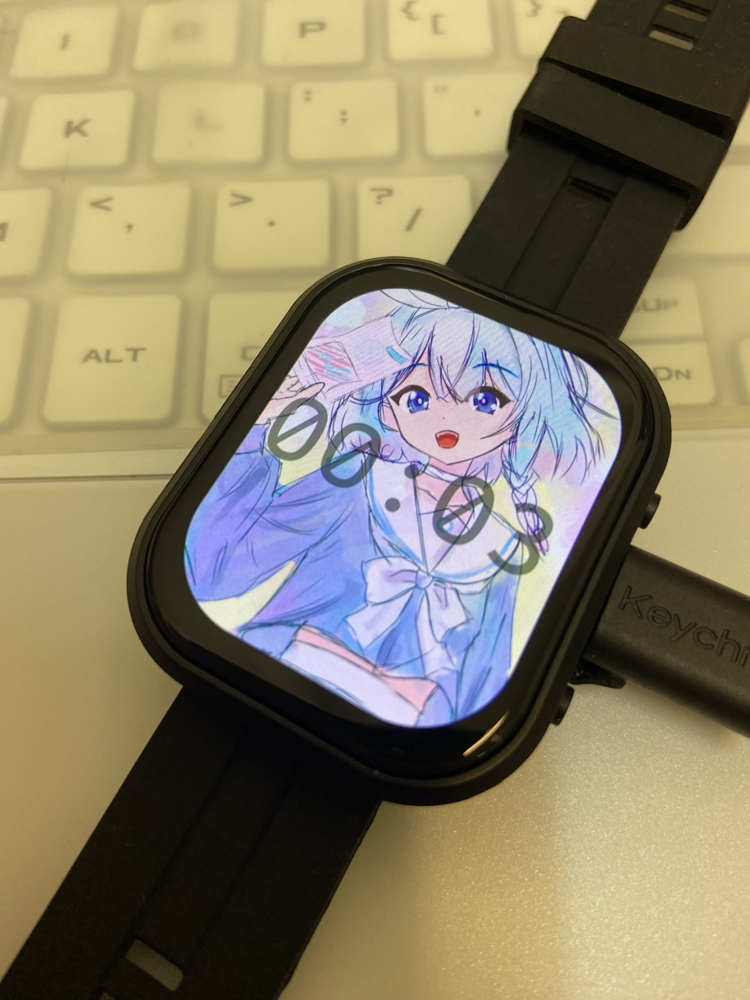

# IllusionOS
An OS for the [Waveshare ESP32-C6 2.06" Watch](https://www.waveshare.com/wiki/ESP32-C6-Touch-AMOLED-2.06).


## Features 
 - Toggling screen with the BOOT button
 - Custom wallpapers
 - Custom fonts (must be monospace)
 - RTC integration
 - Bluetooth integration for battery percentage & time synchronization

## Usage
Some commands may require [just](https://just.systems).
### Flashing the OS
Connect the watch to your computer and run
```
cargo run

# or release mode:
cargo run --release
```

### Changing the wallpaper
The wallpaper image will be centered and cropped so that it fits the screen. This uses imagemagick, so all common image formats can be passed
```
just upload-wallpaper <path/to/wallpaper.png>
```
### Changing the font
A font size of around 120 is recommended for the time display.
The fourth argument is to be a hard-coded 0x260000 for now; This is in preparation for the possibility of multiple fonts in different addresses in the future.
```
# This requires
just upload-font <path/to/font.ttf> <font-size> 0x260000
```

### Synchronizing the time through BLE
You can do this through anything that supports connecting to BLE, but I personally do this with my iPhone. Your BLE client will need to be able to send 8-byte unsigned integers. Then, get an Unix Epoch timestamp in seconds (just truncate 3 digits if it's in ms) and send it to the BLE characteristic `3853b93c-f4ee-4bdf-8083-31ca09862a33`. The timezone is currently fixed to be UTC-4 (EST with daylight savings).

## Credits
[TSTAR Mono](https://www.onlinewebfonts.com/download/220eece2861e0a892f3bc87ad8029d0a)